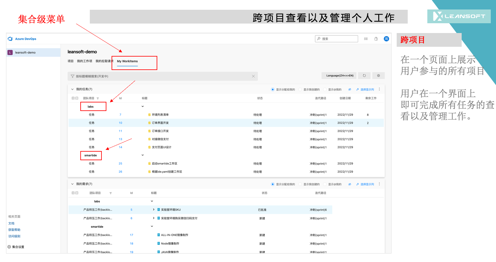

### Cross-project Workbench
---
With this Azure DevOps Cross-project Workbench exntension, user(developers, testers, product managers, and project managers) can complete 90% daily work within just one page. It saves the user that participated in multiple azure devops projects at the same time.

### Key Feature

|  Feature | Desc  |
| ------------ | ------------ |
| Manage workitems Cross-projectly  | User can view/edit/split workitem across projects|
| Manage workitem from different Level/View  |  User can manage workitems that they focus with different views(Tasks/Requirements/Features/Bugs View) |
| Manage workitem from different perspectives | User can manage workitems from different perspectives (Created by me/Assigned to me/@me)|
| split workitem Cross-projectly | User can split workitems from different project within just one page  |
| Edit workitem Cross-projectly | User can edit workitems from different project within just one page |

### Use Guide

  

  

  

  

  

  

### Bussiness Support && About Us
---
Please feel free to contact us by email: henryli@leansoftx.com

Leansoft dedicated in DevOps consulting, implementation, system integration, extension development, report design and other devops related solution. If you have any questions, please fell free to contact us with email above.

### Other extensions you may like

|  Name | Desc  |
| ------------ | ------------ |
| [Workitems Batch Link](https://marketplace.visualstudio.com/items?itemName=leansoftx.ads-extension-workitem-batch-link&ssr=false#overview)  | With this extension you can easily link selected workitems to other workitems from another team project (Support Cross-project, One-To-Many and Many-To-Many relationship)|
| [Pull Request Diff Copy](https://marketplace.visualstudio.com/items?itemName=leansoftx.pull-request-diff-copy)   | With this extension you can easily copy changed files to specifc folder for incremental deployment |
| [Unique Field Control](https://marketplace.visualstudio.com/items?itemName=leansoftx.ads-extension-field-validate)   | with this work item custom control, you can validate the uniqueness of work item field value before saving |

### 跨项目个人工作台
---

通过跨项目个人工作台插件，用户无需进入到具体的Azure DevOps项目下，而是在集合界面视图就可以完成日常90%以上的工作，覆盖开发人员、测试人员、产品经理、项目经理等各个角色。彻底解决了一个用户同时参与多个项目，通过来回频繁切换项目来管理维护各个项目下的需求、缺陷、任务状态，工时等字段的不便利。

### 功能列表

|  功能 | 说明  |
| ------------ | ------------ |
| 跨项目管理工作项  | 用户可以跨项目的查看、更新、拆分与自己相关的工作项数据 |
| 多视图查看与管理个人工作 |  不同的用户角色可以根据不同的视图查看自己关注的数据，包括需求人员、开发人员、测试人员 |
| 多视角查看与管理个人工作 | 用户可以从不同的视角查看与自己相关的工作（创建给我的，分配给我的，@我的）|
| 跨项目快速拆分工作项 | 快速拆分特性、需求 |
| 跨项目闪速编辑工作项 | 无需打开工作项，直接在具体的工作项条目上更新工作项字段信息 |

### 使用说明
---

  

  

  

  

  

  

  

### 商业支持 && 关于我们
---
如有任何问题可以通过邮件与我们联系：henryli@leansoftx.com

英捷创软致力于DevOps咨询，实施，插件开发，系统集成，报表度量设计等相关领域，至今已经为超过100家不同类型和规模的客户提供过ALM/DevOps解决方案的咨询和落地服务。 如您有任何DevOps相关的问题可以随时通过以上邮件与我们取得联系

### 其他插件

|  插件名称 | 插件描述  |
| ------------ | ------------ |
| [工作项批量链接](https://marketplace.visualstudio.com/items?itemName=leansoftx.ads-extension-workitem-batch-link)  | 工作项批量链接插件，可以方便快速的将当前项目下选择的工作项与其他项目的工作项建立链接，一键建立跨项目1对1，1对多，多对多的关联关系。 |
| [Pull Reqeust 变更文件复制](https://marketplace.visualstudio.com/items?itemName=leansoftx.pull-request-diff-copy)   | 当你使用Azure DevOps进行脚本或者静态资源的部署时，往往只需要更新或部署变更的文件，而不是部署所有的静态资源文件或者脚本文件。 比如HTML、JS、CSS、PHP、Python等文件或脚本。所以此插件非常适合增量部署等场景 |
| [工作项字段唯一性校验控件](https://marketplace.visualstudio.com/items?itemName=leansoftx.ads-extension-field-validate)   | 通过此工作项自定义控件，用户可以验证字段值的唯一性，避免出现在多个工作项上出现同一字段中存储相同值的问题 |